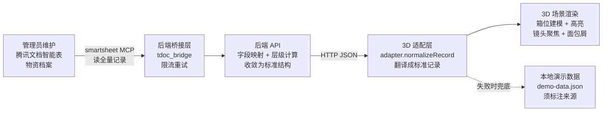
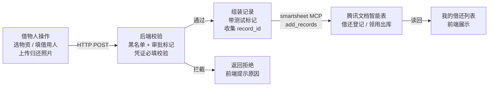
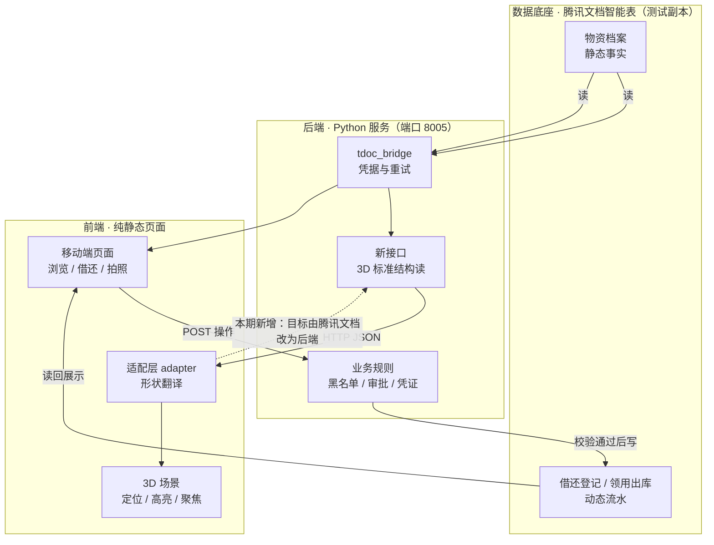

# 仓库智能管理系统 · 技术设计文档（TECH_DESIGN.md）

> **Day 5 产出**。本文档回答一个问题：**数据从哪来、到哪去**——用一句话讲清，用一张图证明。
> **权威声明**：本文档是 `PRD.md`（Day 4）的**技术实现层细化**，不改变 PRD 的功能边界。若与 PRD 或基线 `RESEARCH.md` 冲突，**一律以前两者为准**（分级：`RESEARCH.md` > `PRD.md` > `TECH_DESIGN.md`）。
> **本文档不写代码**，只定路线。Day 7 起照此施工。

---

## 1. 一句话说清数据流（今日核心）

> **数据有两个来源、两条去向：**
> **来源①** 管理员在腾讯文档智能表里维护的**物资档案**（静态事实），**来源②** 借物人在页面上操作产生的**借还/领用流水**（动态记录）。
> **去向①** 物资档案经**后端 API** 读取、转换后，送到前端呈现（列表 + 3D 箱位定位）；**去向②** 借还操作经**后端校验**后，写回腾讯文档生成一条新记录。
> **一句话总纲**：**前端只负责「显示与交互」，后端只负责「规则与业务判断」，腾讯文档智能表负责「持久保存事实」；三者之间只通过 API 传数据，前端不直连数据底座。**

### 1.1 三层职责分工

| 层 | 负责（该管的） | 不负责（不该管的） | 本项目对应 |
| --- | --- | --- | --- |
| **前端** | 呈现数据、接收交互、状态展示（高亮/镜头/面包屑） | 不做业务判断、不接触凭据、不直连数据底座 | `frontend/mobile-prototype`、`3d/warehouse-v2` |
| **后端** | 业务规则（审批/黑名单/凭证校验）、字段映射与层级计算、统一错误处理与重试 | 不决定 UI 长什么样、不替用户做选择 | `backend/prototype_server.py` + `tdoc_bridge/` |
| **数据底座** | 持久化保存事实、保证记录不丢 | 不做任何业务判断（只是仓库，不拦不合规的写） | 腾讯文档智能表（6 张表） |

**边界三条铁律**（记这三条就不会乱）：
1. 前端不直连腾讯文档——它只喊后端。
2. 后端不替用户做决定——"要不要借"是用户点的，"能不能借"才是后端判的。
3. 数据底座不做业务判断——规则在前端与后端之间那道墙上。

### 1.2 概念澄清：接后端 ≠ 接适配层

这两个词常被混为一谈，实际不在一个维度上：

- **适配层**（设计模式）= 一层"翻译官"代码，把**外部数据源的形状**翻译成**自己程序认识的形状**。本项目即 `src/adapter.js` 里的 `normalizeRecord()`：把腾讯文档字段（`物资编号 / 区域 / 排`）翻成标准结构（`materialId / zone / row / position`）。
- **接后端 / 直连数据源** = 适配层**去问谁要数据**。

因此正确的说法不是"接后端**或者**接适配层"，而是：**保留适配层，把它对接的目标从「腾讯文档」换成「后端 API」。** 适配层的价值是隔离变化——将来若从腾讯文档迁到 PostgreSQL，只改适配层，渲染层（`main.js`）一行不动。

---

## 2. 技术路线（今日交付：有理由的一行）

> **技术路线一行结论**：
> **继续沿用「纯静态前端（原生 HTML/JS + Three.js）+ 自托管 Python 轻后端 + 腾讯文档智能表作数据底座」的既有栈；本期唯一架构变更是让 3D 场景的数据来源从「本地演示 JSON」改为「经后端 API 取数」（方案 X），后端新增一个面向 3D 的标准结构读接口。**

**技术栈清单（贴合现有代码库实际，非另起炉灶）：**

| 层 | 技术 | 现状 | 本期动作 |
| --- | --- | --- | --- |
| 前端页面 | 原生 HTML + 原生 JS（**无框架、无构建工具**） | 已具备 | 不改 |
| 3D 可视化 | vanilla **Three.js 0.185.1**（本地 vendor + importmap）+ OutlinePass 高亮 + 双相机小地图 | 已具备 | 改数据来源 |
| 后端服务 | Python **标准库 `http.server`**（`ThreadingHTTPServer`），端口 8005 | 已具备 | 新增 3D 读接口 |
| 文档桥接 | 自研 `tdoc_bridge`：动态导入本机 tencentdocs 模块 + 限流重试 | 已具备 | 复用 |
| 数据底座 | 腾讯文档智能表（smartsheet），6 张表 | 已具备 | 仅读测试副本 |
| 部署形态 | 自托管（本机 / 局域网），不绑云 | 已具备 | 维持 |

---

## 3. 方案对比与选型理由

### 3.1 三个方案

| 方案 | 描述 | 3D 数据流向 |
| --- | --- | --- |
| **A. 现状基线** | 3D 读本地 `demo-data.json`（26 条演示数据） | 3D → 本地 JSON |
| **B. 方案 X（选定）** | 3D 经后端取数，后端桥接腾讯文档 | 3D → 后端 API → 腾讯文档 |
| **C. 方案 Y（否决）** | 3D 的适配层直连腾讯文档 | 3D → 腾讯文档（绕过后端） |

### 3.2 对比表

| 维度 | A. 现状基线（demo） | B. 方案 X：3D 走后端 | C. 方案 Y：3D 直连 |
| --- | --- | --- | --- |
| **数据真实性** | ❌ 26 条假数据 | ✅ 真实（副本）数据 | ✅ 真实数据 |
| **凭据位置** | 无凭据 | ✅ 只留服务端 | ❌ **进浏览器，F12 可见** |
| **与「密钥走环境变量」红线** | 不冲突 | ✅ 不冲突 | ❌ **直接冲突** |
| **业务规则放哪** | 无规则 | ✅ 集中在后端 | ❌ 前移到前端，前端臃肿 |
| **字段/层级计算** | 无 | ✅ 后端算好再吐 | ❌ `adapter.js` 里硬写 |
| **是否重复造轮子** | — | ✅ 复用已有桥接层 | ❌ 重实现桥接/重试/映射 |
| **能否独立演示** | ✅ 能 | ⚠️ 需后端在跑 | ✅ 能 |
| **实现量** | — | 小（后端加接口 + 3D 换开关） | 中（前端重写取数逻辑） |
| **结论** | 保留为**演示模式** | ✅ **采用** | ❌ 否决 |

### 3.3 选定方案 X 的四条理由

1. **不违反安全红线**：项目规定「密钥 / Token 走环境变量，绝不进文件」。前端直连会使凭据暴露于浏览器，且本项目仓库**公开**，此路不通。后端 `tdoc_bridge` 已实现环境变量注入，方案 X 是**延续已走通的路**。
2. **符合分层职责**：板块①确立「规则在后端」。字段计算与业务约定（如"真实『层』在档案中未必存在，需按约定计算")属后端职责；方案 C 会把它塞进前端。
3. **与既有代码零冲突**：`main.js` 已预留 `DATA_SOURCE` 开关，`adapter.js` 已是占位接口，`bridge.py` 已具备读表能力。方案 X 只需"后端加接口 + 适配层改目标"，**无需新建架构**。
4. **方案 C 的唯一优势已被覆盖**：它主打"3D 可独立演示"，但该能力由现有 `demo` 模式提供，且更安全（无凭据）、更快（本地文件）。

### 3.4 数据来源模式总表（最终形态）

| 模式 | `DATA_SOURCE` 取值 | 数据来自 | 用途 |
| --- | --- | --- | --- |
| 演示模式 | `'demo'` | 本地 `data/demo-data.json` | 无网/无后端时演示、UI 调试 |
| **正式模式** | `'api'`（本期新增） | 后端 API → 腾讯文档测试副本 | **本期目标形态** |
| ~~直连模式~~ | ~~`'tencent'`~~ | ~~前端直连腾讯文档~~ | **不采用**（红线冲突） |

---

## 4. 数据流图

### 4.1 读路径：物资档案 → 3D 场景（数据从哪来）

### 4.2 写路径：借还操作 → 记录落表（数据到哪去）

### 4.3 端到端一图流（含本期改动点）

**关键红线约束（图中体现）**：
- 前端**不出现**任何指向数据底座的直接箭头——凭据只存在于后端。
- 后端**不写**物资档案的库存字段（`当前可用数量` / `期初数量`）；借 = 只新增一条借还记录，还 = 只置【实际归还日】，可用数量由外部回算。
- 开发验证**只连测试副本**，不碰正式文档。

### 4.4 一句话复述（截图话术）

> **物资档案从腾讯文档出发，经后端翻译成标准结构，被前端渲染成 3D 箱位；用户的借还操作从页面出发，经后端规则校验，变成腾讯文档里的一条新记录。**

---

## 5. 余力加练

### 5.1 方案变化时，哪些文件会受影响（影响矩阵）

> 用途：以后想改路线时，先查这张表，就知道要动哪些文件、波及多大。

| 若发生这个变化 | 受影响文件 | 影响性质 | 波及范围 |
| --- | --- | --- | --- |
| **3D 数据来源由 demo 改为 api**（本期） | `3d/warehouse-v2/src/main.js`（切 `DATA_SOURCE`） `3d/warehouse-v2/src/adapter.js`（`loadFromTencentDocs` → 改 fetch 后端） `backend/prototype_server.py`（**新增** 3D 读接口） | 新增为主，改动集中在 2 个文件 | 小 |
| **新增黑名单校验**（PRD 本期做） | `backend/prototype_server.py`（借出前加校验） `frontend/mobile-prototype/index.html`（展示拒绝原因） | 后端加规则 + 前端加提示 | 小 |
| **数据底座从腾讯文档迁到 PostgreSQL** | `backend/tdoc_bridge/`（整层替换） `docs/schema/`（schema 映射重写） `backend/prototype_server.py`（`F` 字段字典重写） `3d/warehouse-v2/src/adapter.js`（**几乎不动**，因只认标准结构） 前端页面（不动） | 后端层替换，**前端解耦** | 中 |
| **3D 引入 React / Vite 构建链** | `3d/warehouse-v2/`（整体重构） `index.html` + `src/` + `package.json` | 重写渲染层 | 大 |
| **写入正式文档**（需单独授权） | 环境变量 `TDOC_FILE_ID`（改指向） `docs/schema/`（字段差异复核） `backend/prototype_server.py`（`F` 字典按正式 schema 调整） | 配置 + 字段映射，**业务代码不动** | 小但**高授权等级** |
| **新增报表导出（已砍）** | 后端新增导出接口 + 前端新增页面 | 新增功能域 | 中 |

**从这张表能读出的设计收益**：
- **适配层 + 分层做得对，最大的好处是"换数据底座时前端不用动"**（第 3 行）。
- **真正贵的是"换构建链"**（第 4 行）——所以本期坚持不引入 React/Vite 是对的成本判断。
- **改配置 vs 改代码**：第 5 行显示，切正式文档只需改环境变量 + 复核字段，业务逻辑零改动——这正是"去硬编码"的价值兑现。

### 5.2 技术栈科普：做一个网页 / App 会用到哪些技术

> 用途：建立"技术栈"整体图景，知道每样东西解决什么问题、代价是什么。

**技术栈**（tech stack）= 做一件事时选用的**一组技术工具的集合**。它通常分几层，每层解决一个问题：

| 层 | 解决什么问题 | 常见选项 | 优点 | 缺点 |
| --- | --- | --- | --- | --- |
| **页面结构** | 内容怎么组织 | HTML | 简单、必然要用 | 只能描述结构 |
| **页面样式** | 长什么样 | 原生 CSS / Tailwind / Sass | 原生零依赖；Tailwind 快；Sass 可编程 | 原生 CSS 大项目难维护；Tailwind 类名长；Sass 需构建 |
| **页面交互** | 点了之后发生什么 | 原生 JS / React / Vue / Svelte | 原生零依赖；React 生态大；Vue 上手快；Svelte 简洁 | 原生大项目难管；框架需学习成本与构建链 |
| **3D 可视化** | 空间里怎么显示 | Three.js / Babylon.js / R3F | Three.js 生态最成熟 | 需理解 3D 概念，有学习曲线 |
| **后端服务** | 规则放哪、怎么响应 | Python（Flask/FastAPI/http.server）/ Node（Express）/ Go | Python 易读、生态好；Node 前后端同语言；Go 性能高 | Python 性能一般；Node 异步心智负担；Go 开发速度较慢 |
| **数据存储** | 数据放哪 | PostgreSQL / MySQL / SQLite / 现成表格（腾讯文档/飞书） | 正规库强一致、可查询；表格零部署 | 正规库需运维；表格并发与约束弱 |
| **构建工具** | 代码怎么打包上线 | 无 / Vite / Webpack | 无构建最简单；Vite 快 | 构建链有配置成本、有学习曲线 |
| **部署** | 怎么让别人访问 | 本机 / 局域网 / 云服务器 / Vercel / Supabase | 本机最简单；云可公网访问 | 云需运维与费用 |

**怎么读这张表（选型三问）**：
1. **这个问题是不是真的存在？** 没有对应问题就别引入对应技术（如：没有并发需求就别上 PostgreSQL）。
2. **代价付得起吗？** 每一样技术都带"学习成本 + 运维成本 + 依赖风险"。
3. **能不能复用已有的？** 项目已跑通的技术优先复用（对应 `AGENTS.md` 第九节"先借鉴，再动手"）。

**本项目的选型示范（按三问走一遍）**：
- 需要 3D → 选 Three.js（生态最成熟，且已有 vendor 本地副本，零网络依赖）。
- 需要后端规则 → 选 Python 标准库 `http.server`（**问题很小**：几个 JSON 接口，不值得引入 Flask/Django 的重型框架与依赖）。
- 需要数据库 → **不引入正规库**，用腾讯文档智能表（**问题不大**：单人/小团队、几百条数据，且管理员本来就在用表格）。代价是并发与强约束弱——已记录为"未来数据量上来再平滑迁移"。
- 需要构建工具 → **不引入**（页面就一个 HTML，`importmap` 已够用；引入 Vite 是纯成本）。
- 部署 → 本机 / 局域网（本期不需要公网访问）。

> 一句话总结选型哲学：**每引入一样技术，都是在为它付学费；能不上就不上，非上不可才上。**

---

## 6. 本期改动的风险披露（阶段门禁）

按 `AGENTS.md` 第十节要求，进入 Day 7 编码前先披露：

| 风险 | 说明 | 缓解 |
| --- | --- | --- |
| **数据不全** | 真实档案中"层(level)"未必存在，"区域/排/箱子编号"可能缺失或不准 | 后端按业务约定计算缺失字段；不准的字段用 Mock 兜底并**明确标注来源**（PRD 3.1 第 6 条） |
| **误连正式文档** | 环境变量指向错误会写到正式文档 | 切换前先打印目标 ID 核对；只允许测试副本；写操作全部带测试标记 + 可精确清理 |
| **写库存字段** | 违反项目红线 | 借 = 只新增借还记录；还 = 只置【实际归还日】；**绝不写** `当前可用数量` |
| **接口变更影响前端** | 3D 改走后端后，后端未启动时 3D 会白屏 | 保留 `demo` 模式作兜底；接口失败时前端降级到演示数据并显示来源标注 |
| **凭据泄露** | 公开仓库风险 | 凭据只走环境变量，绝不进文件；打卡仓库文档内不写任何文档 ID |

---

*技术设计结论：技术栈维持既有（纯静态前端 + Three.js + Python 轻后端 + 腾讯文档底座），本期唯一架构变更是 **3D 数据来源由本地演示 JSON 改为经后端 API 取数**；前端直连数据源方案因凭据泄露风险与项目红线冲突而否决。数据流已用读路径 / 写路径 / 端到端三张图说清：**档案从表出发经后端到 3D，操作从页面出发经后端回到表**。*
